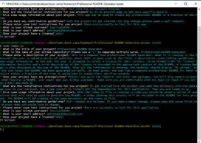
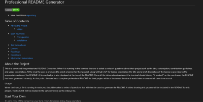

# Professional README Generator

- View the GitHub [repository](https://github.com/Jessica264365/Professional-README-Generator)
- View the [video demonstration](https://drive.google.com/file/d/1if7WTmco69nJCu9IYH9EwHRsvTMqtDqu/view)

## Table of Contents

- [About the Project](https://github.com/Jessica264365/Professional-README-Generator#about-the-project)
  - [Usage](https://github.com/Jessica264365/Professional-README-Generator#usage)

* [Start Your Own](https://github.com/Jessica264365/Professional-README-Generator#start-your-own)
  - [Prerequisites](https://github.com/Jessica264365/Professional-README-Generator#prerequisites)
  - [Installation](https://github.com/Jessica264365/Professional-README-Generator#installation)
  - [Test Instructions](https://github.com/Jessica264365/Professional-README-Generator#test-instructions)

- [License](https://github.com/Jessica264365/Professional-README-Generator#license)
- [Roadmap](https://github.com/Jessica264365/Professional-README-Generator#roadmap)
- [Contribute](https://github.com/Jessica264365/Professional-README-Generator#contribute)
- [My Contact Information](https://github.com/Jessica264365/Professional-README-Generator#my-contact-information)

## About the Project

This is a command line professional README Generator. When it is running in the terminal the user is asked a series of questions about their project such as the title, a description, contribution guidelines, and usage information. At the end, the user is prompted to select a license for their project. Using GitHub’s API for license information the title and a brief description of the license is provided in the appropriate section of the README. A license badge is also displayed at the top of the README. Once all the information is entered, the terminal should display “It worked!” so the user knows the README has been generated correctly. At that point, the user has a complete professional README for their project within a fraction of the time it would take to create their own from scratch.

 

### Usage

When the index.js file is running in node you should be asked a series of questions that will then be used to generate the README. A video showing this process will be included in this section. The README will be created in the same directory as the index.js file. Here is the [video demonstration](https://drive.google.com/file/d/1if7WTmco69nJCu9IYH9EwHRsvTMqtDqu/view).

## Start Your Own

To get a copy of this project on your local computer please follow these next steps.

### Prerequisites

Please read up on the inquirer and axios npm packages. You will also need a project that requires a README, your email and your GitHub username. Make sure you are comfortable with Git Bash (or bash if you are on a Mac) and Node.js.

Clone the GitHub repository: git@github.com:Jessica264365/Professional-README-Generator.git

### Installation

To get started fork the project for your own GitHub and clone the repository. Open the directory where the the package.json is located in your terminal. Run a npm install to install all the dependencies for this application. Then you are ready to go.

### Test Instructions

There are currently no test for this application.

## License

### Do What The F\*ck You Want To Public License

The easiest license out there. It gives the user permissions to do whatever they want with your code.

## Roadmap

This project does not currently have an open issues. Please check the [issues](https://github.com/Jessica264365/Professional-README-Generator/issues) page on GitHub for any updates.

## Contribute

Pull request are welcome. If you make a major change, please open and issue first to discuss what you would like to change.

## My Contact Information

Email: jwhitman135@outlook.com

GitHub Page: [Jessica264365](https://github.com/Jessica264365)
